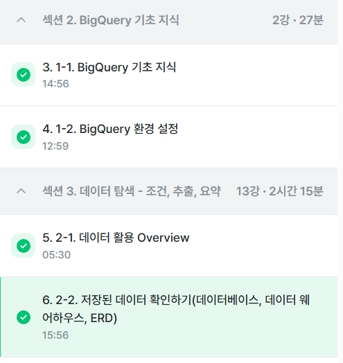

# SQL_BASIC 1주차 정규 과제 

📌SQL_BASIC 정규과제는 매주 정해진 분량의 `초보자를 위한 BigQuery(SQL) 입문` 강의를 듣고 간단한 문제를 풀면서 학습하는 것입니다. 이번주는 아래의 **SQL_Basic_1st_TIL**에 나열된 분량을 수강하고 `학습 목표`에 맞게 공부하시면 됩니다.

**1주차 과제**에서는 수강한 내용을 모두 요약 정리하기보다는, **SQL이 왜 필요한지에 대해 배우고 느낀 점, 그리고 강의를 듣고 본인이 원하는 목표를 중심으로 작성**하여 과제 업로드 시트에 깃허브 링크를 스프레드시트 'SQL' 시트에 붙여서 넣어주세요. 

**👀(수행 인증샷은 필수입니다.)** 

## SQL_BASIC_1st_TIL

### 섹션 2. BigQuery 기초 지식

### 1-1. BigQuery 기초 지식

### 1-2. BigQuery 환경 설정

## 섹션 3. 데이터 탐색 - 조건, 추출, 요약

### 2-1. 데이터 활용 Overview 

### 2-2. 저장된 데이터 확인하기

## 🏁 강의 수강 (Study Schedule)

| 주차  | 공부 범위              | 완료 여부 |
| ----- | ---------------------- | --------- |
| 1주차 | 섹션 **1-1** ~ **2-2** | ✅         |
| 2주차 | 섹션 **2-3** ~ **2-5** | 🍽️         |
| 3주차 | 섹션 **2-6** ~ **3-3** | 🍽️         |
| 4주차 | 섹션 **3-4** ~ **4-4** | 🍽️         |
| 5주차 | 섹션 **4-4** ~ **4-9** | 🍽️         |
| 6주차 | 섹션 **5-1** ~ **5-7** | 🍽️         |
| 7주차 | 섹션 **6-1** ~ **6-6** | 🍽️         |

 

<!-- 여기까진 그대로 둬 주세요-->

---

# 1️⃣ 개념정리 
<!-- 강의 수강 이후에 아래의 학습 목표에 맞게 개념을 자유롭게 정리해주세요.-->
## 1-1. BigQuery 기본지식

<!-- 새롭게 배운 내용을 자유롭게 정리해주세요.-->
데이터는 보통 데이터 베이스- 테이블에 저장

데이터베이스 안에 여러 테이블이 있음. 

최종적으로 데이터는 테이블에 저장

mysql oracle postgresql 와 같은 여러 데이터 베이스에 주로 저장(회사 바이 회사)

oltp = online transaction processing
거래를 하기 위해 사용되는 데이터 베이스
보류 중간 상태가 없음= 주문 완료 or 안하거나 -> 무결한 데이터라고함.
데이터 추가 변경이 많이 발생
sql 을 사용하여 데이터를 추출할 수있으나 분석을 위해 만든 db가 아니므로 쿼리속도가 느림

sql= 데이터베이스에서 데이터를 가지고 올 때 사용하는 언어
row= 행. 가로 한줄. 분류(ex 라면)
column=열. 특정 속성값(ex 신라면)

oltp로 데이터 분석을 하다가 속도 기능부족이슈로 olap 등장
olap= online analytical processing = 분석을 위한 기능
데이터웨어하우스 = 데이터를 한곳에 모아서 저장 

bigquery 장점
1. 난이도 sql 사용하여 쉽게 데이터 추출가능
2. 속도 olap 도구이므로 속도가 빠름 대신 비용이 듬
3. firebase google analytics4 의 데이터를 쉽게 추출 가능( 사용기기 위치등)
4. 데이터 웨어하우스를 사용하기위해 추가적인 서버필요없다 -> 구글에서 인프라 관리함

bigquery를 사용하는 이유
회사에서 앱이나 웹에서 firebase 사용하는경우
운영을 적은 비용으로 진행
사용하는회사가 많음(호환성)

빅쿼리 비용(us기준)
1. 쿼리비용-데이터 탐색비용
-on demand요금제 : 쿼리에서 처리된 용량만큼 부과 1TB당 $6.25
-capacity 요금제 : 1slot당 0.04~0.06

2. 저장비용-저장비용
-Active Logical 저장소 : 1G $0.02
-Long-term Logical :  1G당 $0.01

## 2-1. 데이터 활용 Overview

~~~
✅ 학습 목표 :
* 데이터를 활용하는 과정을 설명할 수 있다.
* 데이터를 탐색하는 과정으로 조건과 추출, 요약을 할 수 있다. 
~~~

<!-- 새롭게 배운 내용을 자유롭게 정리해주세요.-->
빅쿼리 구성요소

1. 프로젝트: 하나의 큰 건물, 건물안에 여러 창고존재(여러 데이터셋 존재)

2. 데이터셋 : 프로젝트에 있는 창고. 각 창고에 데이터를 저장

3. 데이블: 창고에 있는 선반 데이블 안엔 행렬로 이루어진 데이터 존재

파티션이 있는 테이블과 없는 테이블 테이블= 데이터를 나누는 막이 있냐없냐의 차이.

## 2-2. 저장된 데이터 활용하기

~~~
✅ 학습 목표 :
* 데이터가 저장되는 형태를 알고 저장된 데이터를 활용할 수 있다. 
~~~

<!-- 새롭게 배운 내용을 자유롭게 정리해주세요.-->
데이터 활용과정 오버뷰: 어떤 일을 해야한다-> 원하는것을 정한다 ->*필요한 데이터 탐색 (단일자료 or 다량의자료 일때는 연결
->조건(필터링) 추출 변환 요약) ->*데이터 결과 검증(예상과 실제가 일치하는지) -> 피드백/활용

포켓몬으로 이해하는 sql

데이터탐색 : 조건과 추출하기
-sql 기본문법
-SELECT
-FROM
-WHERE

_______________________________________________

데이터가 어떻게 저장되어 있는가?
어떤 데이터가 저장되어있는가?
컬럼의 의미가 무엇인가?
-> 쿼리작성전에 알아야할 3가지 필수요소

데이터웨어하우스(창고) - 테이블(선반) - 데이터(물건)

데이터가 저장되는 형태를 알려면?
-ERD : 데이터베이스 구조도. 

없다면 직접 데이터베이스 뜯어봐야함
-어떤 테이블이 존재?
-어떤 칼럼이 존재?
-다른 데이블과 연결할때 어떤 칼럼을 사용?
-칼럼값은 어떤 의미를 가지는가?
그 이후에 스프레드 시트나 문서로 따로 정리

---
# 2️⃣ 학습 인증란
<!-- 이 글을 지우고, 여기에 학습한 것을 인증해주세요.-->

 
 

---

# 3️⃣ 확인문제

## 문제 1

> **🧚Q. 포켓몬 게임이나 이커머스 산업과 같이 다양한 산업에서는 각기 다른 데이터가 존재합니다. 다음 중 하나의 산업을 선택하고, 해당 산업에서 수집하고 활용될 수 있는 데이터 항목 (칼럼) 5가지를 자유롭게 상상하여 나열해보세요.**
>
> - 예시 산업 
>
> >  온라인 음식 배달 / 스마트 헬스 케어 / 중고 거래 앱 / 교육 플랫폼 등 

<!--현실과 데이터 분석의 연결 고리를 상상하고, 데이터를 저장하는 형태를 활용하는 문제입니다. -->

<!--학습한 개념을 활용하여 자유롭게 설명해 보세요. 구체적인 예시를 들어 설명하면 더욱 좋습니다.-->

~~~
선택산업: 중고 거래앱
판매자 테이블: 판매자 id, 판매자 거주지, 판매자 거래온도, 판매자 나이, 판매 목적
구매자 테이블: 구매자 id, 구매자 거주지, 구매목적, 구매자 나이, 지금까지의 거래횟수
중고거래 테이블: 거래 품목, 판매자id, 구매자id, 거래 방법, 거래 금액
매출 테이블: 거래 품목, 수수료, 거래빈도수, 4월 거래액, 12월 거래액 
~~~

## 문제 2

> **🧚Q. 이번 강의를 통해 SQL이 왜 필요하다고 느끼는지, SQL을 통해 본인이 어떤 것을 해내고 싶은지를 자유롭게 작성해보세요.**

~~~
어떤 산업이든 간에, 방대한 양의 데이터를 가공하여 알기 쉬운 정보로 가공하는 과정이 매우 중요하다고 생각했습니다. 이를 위한 도구로서 SQL이 꼭 필요하다고 느꼈고, 추후에 마케팅이나 금융, 제조업 등 한 분야를 정해 그 분야에 맞는 데이터를 가공 분석 처리해보고 싶습니다.
~~~

### 🎉 수고하셨습니다.

