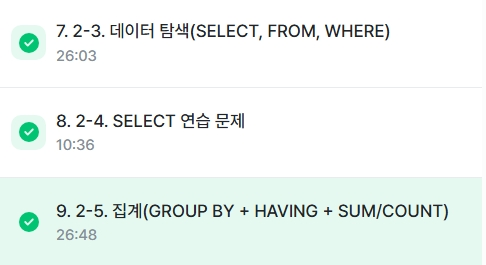

# SQL_BASIC 2주차 정규 과제 

📌SQL_BASIC 정규과제는 매주 정해진 분량의 `초보자를 위한 BigQuery(SQL) 입문` 강의를 듣고 간단한 문제를 풀면서 학습하는 것입니다. 이번주는 아래의 **SQL_Basic_2nd_TIL**에 나열된 분량을 수강하고 `학습 목표`에 맞게 공부하시면 됩니다.

**2주차 과제**는 1주차 과제처럼 SQL의 필요성이나 느낀점 위주가 아닌, **실제 강의 내용을 바탕으로 개념을 정리하고 학습한 내용을 집중적으로 기록**해주세요. 완성된 과제는 Github에 업로드하고, 링크를 스프레드시트 'SQL' 시트에 입력해 제출해주세요. 

**👀(수행 인증샷은 필수입니다.)** 

## SQL_BASIC_2nd

### 섹션 3. 데이터 탐색 - 조건, 추출, 요약

### 2-3. 데이터 탐색 (SELECT, FROM, WHERE)

### 2-4. SELECT 연습문제

### 2-5. 집계 (Group By + Having + Sum/Count)

## 🏁 강의 수강 (Study Schedule)

| 주차  | 공부 범위              | 완료 여부 |
| ----- | ---------------------- | --------- |
| 1주차 | 섹션 **1-1** ~ **2-2** | ✅         |
| 2주차 | 섹션 **2-3** ~ **2-5** | ✅         |
| 3주차 | 섹션 **2-6** ~ **3-3** | 🍽️         |
| 4주차 | 섹션 **3-4** ~ **4-4** | 🍽️         |
| 5주차 | 섹션 **4-4** ~ **4-9** | 🍽️         |
| 6주차 | 섹션 **5-1** ~ **5-7** | 🍽️         |
| 7주차 | 섹션 **6-1** ~ **6-6** | 🍽️         |

 

<!-- 여기까진 그대로 둬 주세요-->

---

# 1️⃣ 개념정리 

## 2-3. 데이터 탐색 (SELECT, FROM, WHERE)

~~~
✅ 학습 목표 :
* SQL 쿼리 구조를 이해할 수 있다. 
* SELECT, FROM, WHERE의 핵심 문법을 설명할 수 있다. 
~~~

<!-- 새롭게 배운 내용을 자유롭게 정리해주세요.-->
쿼리문 다음과 같은 문법으로 작성

@select : 테이블의 어떤 칼럼을 선택할것인가?
Col1 As new_name

@From: Dataset.Table : 어떤 테이블에서 데이터를 확인할 것인가?
ex) From basic(데이터셋).pokemon(테이블)

@Where: 만약 원하는 조건이 있다면 어떤 조건인가? -> col1 =1 : 조건문

SELECT
*( 모든 칼럼 출력!! 행이 적을 때는 큰 이슈가 없다)
From basic(데이터셋).pokemon(테이블)
WHERE
 type1= "Fire"

SELECT
 *EXCEPT(제외할 칼럼)

SELECT     SELECT 
 col        col
FROM       FROM
Table1     Table2
->데이터 겹치는거 조인가능

## 2-5. 집계 (Group By / HAVING / SUM,COUNT)

~~~
✅ 학습 목표 :
* 데이터를 집계하고 그룹화하는 방법을 설명할 수 있다.
* GROUP BY, HAVING, ORDER BY, 집계함수(SUM/COUNT 등)을 활용하는 방법을 설명할 수 있다.
* having과 where의 차이에 대해서 설명할 수 있다.
~~~

<!-- 새롭게 배운 내용을 자유롭게 정리해주세요.-->
데이터 탐색: 요약(집계 , 그룹화)

집계하다 : 모아서 계산하다
계산= 더하기뺴기 최대최소값 평균 갯수세기

집계 : GROUP BY :같은 값끼리 모아서 그룹화한다(평균, 수 ..)
-특정 칼럼을 기준으로 모으면서 다른 컬럼에선 집계가능

정렬하기(오름차순 내림차순)

10마리 이상인 데이터만 추출하고 싶은 경우
-> 포켓몬 수에 조건 달면됨(단, 집계후에는 having 사용)

*기본구조!!
SELECT
 집계할 칼럼1
 집계함수
FROM Table
GROUP BY
 집계할 칼럼1

집계함수 자주사용 Count(row 세기) avg countif(특정조건 row세기) max min sum

DISTINCT : 고유값을 알고싶은 경우 -> 중복제거

SELECT
 집계할칼럼
 COUNT(DISTINCT count할 칼럼)
FROM table
GROUP BY
 집계할 칼럼

1. pokemon 테이블에 있는 포켓몬 수 구하기
SELECT
 COUNT(id)
FROM basic.pokemon

2. 포켓몬의 수가 세대별로 얼마나 있는지 알수있는 쿼리

SELECT
 generation
 COUNT(id)
FROM basic.pokemon
GROUP BY
 generation

그룹화(집계) 활용 포인트
- 일자별 집계(원본데이터는 특정시간에 어떤 유저가 한 행동 기록)
- 연령대별 집계( 특정 연령대에서 더 많이 구매했는가)
- 특정 타입별 집계(특정 제품 타입을 많이 구매했는가)
- 앱 화면별 집계( 어떤 화면에 유저가 많이 접근했는가)

WHERE - 테이블에 바로 조건을 설정하고 싶은 경우 사용
HAVING- GROUP BY 한 후 조건을 설정하고 싶은 경우 사용

서브쿼리- select 문 안에 존재하는 select 쿼리.

정렬하기 ORDER BY
SELECT
 col
FROM
 ORDER BY 컬럼 순서

순서 : DESC(내림차순) OSC(오름차순)

출력갯수 제한하기 :LIMIT
쿼리문의 결과 ROW수를 제한하고싶은 경우 사용
쿼리문 제일 마지막에 작성

3. 포켓몬의 수를 타입별로 집계하고 포켓몬의 수가 10이상인 타입만 남기는 쿼리 작성. 많은 순으로 정렬

SELECT
 type1
 Count(id)
FROM basic.pokemon
GROUP BY
 type1
HAVING id>=10
ORDER BY id DESC

# 2️⃣ 학습 인증란

  

---

# 3️⃣ 확인문제

## 문제 1

> **🧚Q. 포켓몬 마스터 승화는 포켓몬 데이터 조회하는 SQL문에 재미를 느껴서 혼자서 데이터를 조회하는 쿼리문을 짰습니다. 하지만 세 가지의 오류로 다음 코드가 실행이 안된다고 하는데, 각 오류의 위치와 이유를 설명하고, 올바른 쿼리문으로 수정해보세요.**

~~~sql
# 승화의 SQL Query문 
SELECT name AS '포켓몬 이름', ID;
WHERE type = 'Electric';
FROM pokemon;
~~~

~~~
1. 잘못된 열 이름 name -> kor_name
2. 잘못된 절 순서
3. 세미콜론의 잘못된 위치(마지막에만!!)

SELECT
 kor_name As '포켓몬 이름',
 id
FROM basic.pokemon
WHERE type1 = 'Electric';
~~~

## 문제 2

> **🧚Q. 앞서 SQL Query의 오류를 해결한 승화는 기분 좋게 이번에는 포켓몬 데이터에서 타입별 평균 공격력이 60 이상인 타입만 조회하려는 쿼리를 작성하려고 했습니다. 하지만 이번에도 실수를 하여 쿼리문이 실행되지 않거나 잘못된 결과가 나오고 있는데, 쿼리에서 잘못된 부분이 무엇인지 설명하고, 올바르게 수정한 쿼리를 작성해보세요.**

~~~sql
SELECT type, AVG(attack) AS avg_attack
FROM pokemon
WHERE AVG(attack) >= 60
GROUP BY type;
~~~

~~~
1. 잘못된 열 이름 type -> type1 or type2..
2. AVG 함수를 사용 한 후 조건을 걸때에는 HAVING 사용

SELECT 
 type1, 
 AVG(attack) AS avg_attack
FROM pokemon
GROUP BY type1
HAVING AVG(attack) >= 60;
~~~

### 🎉 수고하셨습니다.