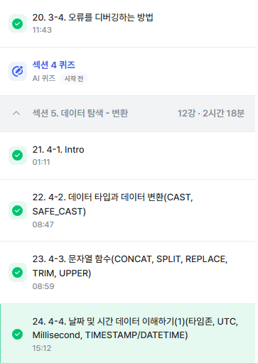

# SQL_BASIC 4주차 정규 과제 

📌SQL_BASIC 정규과제는 매주 정해진 분량의 `초보자를 위한 BigQuery(SQL) 입문` 강의를 듣고 간단한 문제를 풀면서 학습하는 것입니다. 이번주는 아래의 **SQL_Basic_4th_TIL**에 나열된 분량을 수강하고 `학습 목표`에 맞게 공부하시면 됩니다.

**4주차 과제부터는 강의 내용을 정리하는 것과 함께, 프로그래머스에서 제공하는 SQL 문제를 직접 풀어보는 실습도 병행합니다.** 강의에서는 **배운 내용을 정리하고 주요 쿼리 예제를 정리**하며, 프로그래머스 문제는 **직접 풀어본 뒤 풀이 과정과 결과, 배운 점을 함께 기록**해주세요. 완성된 과제는 Github에 업로드하고, 링크를 스프레드시트 'SQL' 시트에 입력해 제출해주세요.

**(수행 인증샷은 필수입니다.)** 

## SQL_BASIC_4th

### 섹션 4. 쿼리 잘 작성하기, 쿼리 작성 템플릿 및 오류를 잘 디버깅하기

### 3-4. 오류를 잘 디버깅하는 방법

## 섹션 5. 데이터 탐색 - 변환

### 4-1. INTRO

### 4-2. 데이터 타입과 데이터 변환(CAST, SAFE_CAST)

### 4-3. 문자열 함수(CONCAT, SPLIT, REPLACE, TRIM, UPPER)

### 4-4. 날짜 및 시간 데이터 이해하기(1) (타임존, UTC, Millisecond, TIMESTAMP/DATETIME)

## 🏁 강의 수강 (Study Schedule)

| 주차  | 공부 범위              | 완료 여부 |
| ----- | ---------------------- | --------- |
| 1주차 | 섹션 **1-1** ~ **2-2** | ✅         |
| 2주차 | 섹션 **2-3** ~ **2-5** | ✅         |
| 3주차 | 섹션 **2-6** ~ **3-3** | ✅         |
| 4주차 | 섹션 **3-4** ~ **4-4** | ✅         |
| 5주차 | 섹션 **4-4** ~ **4-9** | 🍽️         |
| 6주차 | 섹션 **5-1** ~ **5-7** | 🍽️         |
| 7주차 | 섹션 **6-1** ~ **6-6** | 🍽️         |

 

<!-- 여기까진 그대로 둬 주세요-->

---

# 1️⃣ 개념정리

## 3-4. 오류를 디버깅하는 방법

~~~
✅ 학습 목표 :
* 오류의 정의에 대해 설명할 수 있다. 
* 오류 메시지를 보고 디버깅이라는 과정을 수행할 수 있다. 
~~~

<!-- 새롭게 배운 내용을 자유롭게 정리해주세요.-->
오류의 정의: 방황하다, 길을 잃다. 즉 부정확하거나, 잘못된 행동을 의미.

오류메세지가 알려주고자 하는 것.
-현재 작성한 방식으로 하면 답없음(길잡이 역할)
-이 부분이 문제가 있음 (문제진단)

오류를 바라보는 관점: 길잡이가 나를 더 좋은길로 나아가게 하려는구나!(positive)

대표적인 오류 카테고리: syntax Error
->Error Message 해석 후 구글 혹은 gpt, 지인에게 질문.

## 4-2. 데이터 타입과 데이터 변환(CAST, SAFE_CAST)

~~~
✅ 학습 목표 :
* 데이터 타입의 종류를 설명할 수 있다. 
* 데이터 타입을 변환하는 방법을 설명할 수 있다. 
~~~

<!-- 새롭게 배운 내용을 자유롭게 정리해주세요.-->
데이터 변환!!

SELECT문에서 AS 혹은 WHERE 조건문 으로 변환도 가능.

대표적인 데이터 타입= 숫자, 문자 , 시간or날짜, 부울

*숫자: 1,2,3,... 정수 3.14

*문자: "나" "데이터"

*시간,날짜: 2024-01-01-23:59:00

*부울: 참/거짓.

데이터타입이 중요한 이유? - 보이는 것과 저장된 것의 차이가 존재
ex) 
1. 엑셀에서 빈 값: "일 수도 있고, NULL일 수도 있음
2. 1이라고 작성된 경우: 숫자1일수도, 문자1일 수도 있음

자료타입을 변경하는 함수: 
(1) CAST

SELECT
 CAST(1 AS STRING) #숫자1을 문자1로 변경

(2) SAFE_CAST
SAFE_가 붙은 함수는 변환이 실패할 경우 NULL 반환

(3) 다양한 수학 연산 함수 존재
-나누기를 할 경우 x/y 대신 SAFE_DIVIDE 함수 사용가능

## 4-3. 문자열 함수(CONCAT, SPLIT, REPLACE, TRIM, UPPER)

~~~
✅ 학습 목표 :
* 문자열 함수들의 종류를 이해하고 어떠한 상황에서 사용하는지 설명할 수 있다. 
~~~

<!-- 새롭게 배운 내용을 자유롭게 정리해주세요.-->
문자열 함수: "안녕하세요" "카일스쿨"

(1) 문자열 붙이기
SELECT
 CONCAT("안녕" , "하세요") AS result

(2) 문자열 분리하기
SELECT
 SPLIT("가, 나 , 다, 라", ",") AS result

(3) 특정단어 수정하기
SELECT
 REPLACE("안녕하세요", "안녕", "실천") AS result

(4) 문자열 자르기
SELECT
 TRIM("안녕하세요", "하세요") AS result

(5) 영어 대문자 변환
SELECT
 UPPER("abc") AS result

## 4-4. 날짜 및 시간 데이터 이해하기(1) (타임존, UTC, Millisecond, TIMESTAMP/DATETIME)

~~~
✅ 학습 목표 :
* 날짜 및 시간 데이터 타입과 UTC의 개념을 설명할 수 있다. 
* DATE, DATETIME, TIMESTAMP 에 대해서 설명할 수 있다.
* 시간함수들의 종류와 시간의 차이를 추출하는 방법을 설명할 수 있다. 
~~~

<!-- 새롭게 배운 내용을 자유롭게 정리해주세요.-->
날짜 및 시간 데이터 핵심

(1) 날짜 및 시간 데이터 타입 파악: DATE, DATETIME, TIMESTAMP

(2) 날짜 및 시간 데이터 관련 알면 좋은 내용: UTC, Millisecond

(3) 날짜 및 시간 데이터 타입 변환하기

(4) 시간 함수 (두 시간의 차이, 특정 부분 추출)

*시간 데이터 다루기
- 시간 데이터도 세부적으로 나눌 수 있음
DATE, DATETIME, TIMESTAMP

DATE: DATE만 표시하는 데이터
DATETIME: DATE+TIME 표시
TIME: 날짜와 무관하게 시간만 표시하는 데이터

- 타임존: 
GMT (그리니치 기준 시간조정) 
UTC (현재 국제적인 표준 시간)
TIMESTAMP (시간 도장)

-millisecond(천 분의 1초), microsecond( 1/1000 ms)

-시간 데이터끼리의 변환
많은 회사들의 Table에 시간이 TIMESTAMP 로 저장된 경우 많음 -> DATETIME으로 변환 가능해야함

ex) 2024년 1월 18일 20시 55분(한국시간)에 실행
SELECT
 CURRENT_TIMESTAMP() AS timestamp_col,
 DATETIME(CURRENT_TIMESTAMP(),'Asia/Seoul') AS datetime_col
-> TIMESTAMP의 경우 UTC(한국시간 -9시간), DATETIME의 경우 T가 나옴(한국시간 동일)

 

 

---

# 2️⃣ 확인문제 & 문제 인증

## 프로그래머스 문제 

> 조건에 맞는 회원 수 구하기 (SELECT, COUNT) 
>
> **먼저 문제를 풀고 난 이후에 확인 문제를 확인해주세요**
>
> 문제 링크 
>
> :  https://school.programmers.co.kr/learn/courses/30/lessons/131535#

<!-- 문제를 풀기 위하여 로그인이  필요합니다. -->

<!-- 정답을 맞추게 되면, 정답입니다. 라는 칸이 생성되는데 이 부분을 캡처해서 이 주석을 지우시고 첨부해주시면 됩니다. -->

## 문제 1

> **🧚Q. 프로그래머스 문제를 풀던 서현이는 여러 번의 시행착오 끝에 결국 혼자 해결하기 어려워 오류 메시지를 공유하며 도움을 요청했습니다. 여러분들이 오류 메시지를 확인하고, 해당 SQL 쿼리에서 어떤 부분이 잘못되었는지 오류 메시지를 해석하고 찾아 설명해주세요.**

~~~sql
# 조건에 맞는 회원 수 구하기 (SELECT, COUNT) 
# 서현이의 SQL 첫 번째 풀이
SELECT COUNT(AGE, JOINED)
FROM USER_INFO
WHERE AGE BETWEEN 20 AND 29
  AND JOINED BETWEEN '2021-01-01' AND '2021-12-31';
  
오류 메시지 : Error: Number of arguments does not match for aggregate function COUNT
 
# 수정하고 난 이후 두 번째 풀이
SELECT AGE, COUNT(*)
FROM USER_INFO
WHERE AGE BETWEEN 20 AND 29
  AND JOINED BETWEEN '2021-01-01' AND '2021-12-31';
  
오류 메시지 : SELECT list expression references column AGE which is neither grouped nor aggregated
~~~

~~~
첫번째 오류수정의 경우 COUNT() 안에 인자 수를 잘못 넣었다. *로 전체 칼럼을 받거나 특정칼럼 하나만을 받았어야한다

두번째 오류수정의 경우 이 오류는 집계 함수(COUNT(*))와 일반 컬럼(AGE)을 함께 SELECT 절에 사용했지만, 일반 컬럼을 GROUP BY 절로 묶어주지 않았기 때문에 발생한것이다.
즉, SELECT 절에서 AGE를 제거하고 COUNT(*)만 남겨야 함
~~~

### 🎉 수고하셨습니다.
