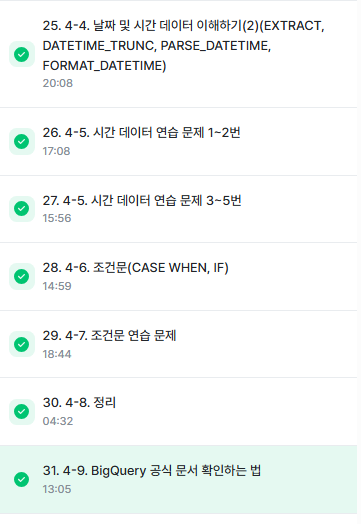

# SQL_BASIC 5주차 정규 과제 

📌SQL_BASIC 정규과제는 매주 정해진 분량의 `초보자를 위한 BigQuery(SQL) 입문` 강의를 듣고 간단한 문제를 풀면서 학습하는 것입니다. 이번주는 아래의 **SQL_Basic_5th_TIL**에 나열된 분량을 수강하고 `학습 목표`에 맞게 공부하시면 됩니다.

**5주차 과제는 문제 풀이를 중심으로**, 강의에서 제시된 예제 문제 중 **3 문제 이상을 선택하여 직접 풀어본 뒤**, 강의 영상의 풀이와 비교해 **틀린 부분, 맞은 부분, 새롭게 배운 개념**을 구체적으로 정리해주세요. (적어도 4문제는 정리해야 합니다.) 완성된 과제는 Gihub에 업로드하고, 링크를 스프레드시트 'SQL' 시트에 입력해 제출해주세요.

**(수행 인증샷은 필수입니다.)** 

## SQL_BASIC_5th

### 섹션 5. 데이터 탐색 - 변환

### 4-4. 날짜 및 시간 데이터 이해하기(2) (EXTRACT, DATETIME_TRUNC, PARSE_DATETIME, FROMAT_DATETIME)

### 4-5. 시간 데이터 연습문제 1~2번

### 4-5. 시간 데이터 연습문제 3~5번

### 4-6. 조건문 (CASE WHEN, IF)

### 4-7. 조건문 연습 문제

### 4-8. 정리

### 4-9. BigQuery 공식 문서 확인하는 법

(강의에서 연습문제가 많아서 따로 프로그래머스 문제 과제는 없습니다.)

## 🏁 강의 수강 (Study Schedule)

| 주차  | 공부 범위              | 완료 여부 |
| ----- | ---------------------- | --------- |
| 1주차 | 섹션 **1-1** ~ **2-2** | ✅         |
| 2주차 | 섹션 **2-3** ~ **2-5** | ✅         |
| 3주차 | 섹션 **2-6** ~ **3-3** | ✅         |
| 4주차 | 섹션 **3-4** ~ **4-4** | ✅         |
| 5주차 | 섹션 **4-4** ~ **4-9** | ✅         |
| 6주차 | 섹션 **5-1** ~ **5-7** | 🍽️         |
| 7주차 | 섹션 **6-1** ~ **6-6** | 🍽️         |

 

<!-- 여기까진 그대로 둬 주세요-->

---

# 4-4. 날짜 및 시간 데이터 이해하기(2) (EXTRACT, DATETIME_TRUNC, PARSE_DATETIME, FROMAT_DATETIME)

~~~
✅ 학습 목표 :
* 날짜 및 시간 데이터에 대해서 더 자세히 설명할 수 있다. 
* CURRENT_TIME, EXTRACT, DATETIME_TRUNC, PARSE_DATETIME, FROMAT_DATETIME 을 설명할 수 있다. 
~~~

<!-- 새롭게 배운 내용을 자유롭게 정리해주세요.-->
DATATIME 함수 -EXTRACT
DATATIME에서 특정 부분만 추출하고 싶은 경우(일자별 주문, 월별 주문)

요일을 추출하고 싶은 경우
EXTRACT(DAYOFWEEK FROM datetime_col)
- 한주의 첫날이 일요일인 [1,7] 범위 값을 반환

DATE 와 HOUR만 남기고 싶은 경우 -> 시간 자르기
DATETIME_TRUNC(datetime_col,HOUR)

DATETIME 함수- PARSE_DATETIME
문자열로 저장된 DATETIME을 DATETIME타입으로 바꾸고 싶은 경우
PARSE_DATETIME('문자열의 형태', 'DATETIME 문자열') AS datetime

DATETIME 함수- FORMAT_DATETIME
DATETIME 타입 데이터를 특정형태의 문자열 데이터로 변환하고 싶은 경우

DATETIME 함수- LAST_DAY
마지막 날을 알고 싶은 경우: 자동으로 월의 마지막 값을 계산하여 특정 연산을 할 경우

DATETIME 함수 - DATETIME_DIFF
두 DATETIME의 차이를 알고 싶은 경우 
DATETIME_DIFF(첫DATETIME, 두번째 DATETIME, 궁금한 차이)

# 4-6. 조건문(CASE WHEN, IF)

~~~
✅ 학습 목표 :
* 조건문 함수의 기능을 이해하고, 설명할 수 있다. 
~~~

<!-- 새롭게 배운 내용을 자유롭게 정리해주세요.-->
조건문
- 만약 특정 조건이 충족되면 어떤 행동을 하자
- 특정 조건이 참일때 A, 아니면 B
(조건에 따른 분기처리가 필요한 경우)
- 조건에 따라 다른 값을 표시하고 싶을 때 사용

조건문을 사용하는 2가지 방법
1. CASE WHEN
2. IF

조건문 함수가 사용되는 이유 
- 데이터 분석을 하다보면, 특정 카테고리를 하나로 합치는 전처리가 필요할 수 있음
why? 데이터를 저장하는 쪽과 데이터를 분석하는 쪽이 보통 나뉨+ 분석할 때 필요한 부분에서 조건 설정해서
변경하는게 더 효율적임.

CASE WHEN - 여러 조건이 있을 경우에 유용, 코드짤때 순서 매우 중요함. 

SELECT 
 CASE
  WHEN 조건1 THEN 조건1이 참일 경우 결과
  WHEN 조건2 THEN 조건2가 참일 경우 결과
  ELSE 그외 조건일 경우 결과
END AS 새로운 칼럼 이름
FROM~

조건문 IF - 단일 조건일 경우 유용

SELECT
 IF(1=1, '동일한 결과', '동일하지 않은 결과') AS result1,
 IF(1=2, '동일한 결과', '동일하지 않은 결과') AS result2

 # 4-5. 시간 데이터 연습문제 & 4-7. 조건문 연습 문제

~~~
✅ 학습 목표 :
* 4-5, 4-7 각각에서 두 문제 이상 (최소 4문제) 푼 내용 정리하기
~~~

<!-- 새롭게 배운 내용을 자유롭게 정리해주세요.-->
1. 
--catch_date : DATE 타입
--catch_datetime : UTC. TIMESTAMP 타입 => 컬럼의 이름은 datetime인데 TIMESTAMP 타입으로 저장되어있다
칼럼의 이름만 믿고 바로 커리를 작성하는것이 아니라, 꼭 데이터를 확인해봐야한다.
--catch_date => KR기준? UTC기준?
--catch_date 컬럼과 catch_datetime 컬럼을 비교 =>  DATE(DATETIME(catch_datetime, "Asia/seoul"))

SELECT
 *
FROM(
SELECT
 id,
 catch_date,
 DATE(DATETIME(catch_datetime, "Asia/seoul")) As catch_datetime_kr_date
FROM basic.trainer_pokemon
)
WHERE
 catch_date = catch_datetime_kr_date

SELECT
 COUNT(DISTINCT id) AS cnt
FROM basic.trainer_pokemon
WHERE
 EXTRACT(YEAR FROM DATETIME(catch_datetime, "Asia/Seoul")) = 2023
 AND EXTRACT(MONTH FROM DATETIME(catch_datetime, "Asia/Seoul")) = 1

# 문제출제의도: 요청한 사람 또는 문제를 그대로 볼 경우에 틀릴 수 있음. 항상 확인해야함!!

2. 배틀이 일어난 시간을 기준으로 오전 6시~오후6시 사이에 일어난 배틀의 수를 계산해주세요.

SELECT
 id,
 battle_datetime,
 DATETIME(battle_timestamp, "Asia/Seoul") AS battle_timestamp_kr,
 COUNTIF(battle_datetime = DATETIME(battle_timestamp, "Asia/Seoul")) AS battle_datetime_same_battle_timestamp_kr,
 COUNTIF(battle_datetime ! = DATETIME(battle_timestamp, "Asia/Seoul")) AS battle_datetime_not same_battle_timestamp_kr
FROM basic.battle
# 실행결과 모두 같은것을 알 수 있음, 신뢰가능하다. 이 작업 후에 본문제 풀이 시작해야한다.

SELECT

FROM basic.battle
WHERE 
 EXTRACT(HOUR FROM battle_datetime) >= 6
 AND EXTRACT(HOUR FROM battle_datetime) <= 18

3. 포켓몬의 speed가 70 이상이면 '빠름', 그렇지 않으면 '느림'으로 표시하는 새로운 칼럼
Speed_Category를 만들어 주세요

SELECT 
 MIN(speed) AS min_speed,
 MAX(speed) As max_speed
FROM basic.pokemon

->[5,140] 스피드 구간확인완료

SELECT
 *
 IF(speed>=70, "빠름","느림") AS Speed_Category
FROM basic.pokemon

4. 포켓몬의 type1 에 따라 water, Fire, Electric 타입은 각각 물,불,전기로 그외 타입은 기타로 분류하는
새로운 칼럼 'type_korean'을 만들어 주세요.

#조건이 여러개 이므로 CASE WHEN 사용해야징

SELECT
 id,
 kor_name,
 type1,
 CASE
  WHEN type1= "water" THEN "물"
  WHEN type1= "Fire" THEN "불"
  WHEN type1= "Electric" THEN "전기"
  ELSE "기타"
END AS type1_Korean
FROM basic.pokemon

 

 

---

# 확인문제

## 문제 1

> **🧚Q. 광윤이는 사용자 로그 데이터에서, 2021년에 접속한 사용자 수를  집계하려고 했습니다. 그는 여러 SQL 쿼리들을 실행해봤지만, 그 중 일부는 문법적으로 잘못되어 실행되지 않았습니다. 다음 보기 중 틀린 쿼리를 모두 골라보세요 (복수 선택 가능)**

~~~sql
1. SELECT COUNT(*)  
   FROM user_log  
   WHERE EXTRACT(YEAR FROM login_date) = 2021;

2. SELECT EXTRACT(YEAR FROM login_date), COUNT(*)  
   FROM user_log  
   GROUP BY EXTRACT(YEAR FROM login_date);

3. SELECT COUNT(*)  
   FROM user_log  
   WHERE login_date = '2021';

4. SELECT COUNT(*)  
   FROM user_log  
   WHERE login_date BETWEEN '2021-01-01' AND '2021-12-31';
~~~

<!-- 틀린쿼리에 대한 오류의 원인도 같이 작성해주세요. 문제에서 제공된 login_data 컬럼은 DATE type의 데이터를 가지고 있다고 가정하시면 됩니다. -->

~~~
3번 쿼리가 틀렸음
login_date는 DATE 타입으로, 연도, 월, 일이 포함된 전체 날짜 정보를 담고 있지만
'2021'은 단순한 문자열임.

DATE 타입 컬럼을 단지 연도만 포함하는 문자열과 WHERE login_date = '2021'와 같이 동등 비교하는 것은 SQL에서 허용X
~~~

## 문제 2

> **🧚Q. 혜성이는 포켓몬 타입에 따라 설명을 부여하는 쿼리를 작성했습니다. type 1 컬럼의 값에 따라 조건을 분기했으며, 다음 SQL 쿼리를 실행했습니다.**

~~~sql
SELECT name,
       CASE 
         WHEN type1 = 'Fire' THEN 'Hot'
         WHEN type1 = 'Water' THEN 'Cool'
         ELSE 'Normal'
       END AS type_description
FROM pokemon;
~~~

> **다음 중 type_description의 결과가 'Normal'로 출력될 포켓몬은?**

| **name**   | **type1** |
| ---------- | --------- |
| Pikachu    | Electric  |
| Charmander | Fire      |
| Squirtle   | Water     |
| Bulbasaur  | Grass     |

<!-- 근거와 함께 답을 작성해주세요 -->

~~~
Pikachu - electric 단일 이므로 ELSE로 들어감
Bulbasaur- Grass 단일 이므로 ELSE로 들어감
~~~

 

### 🎉 수고하셨습니다.